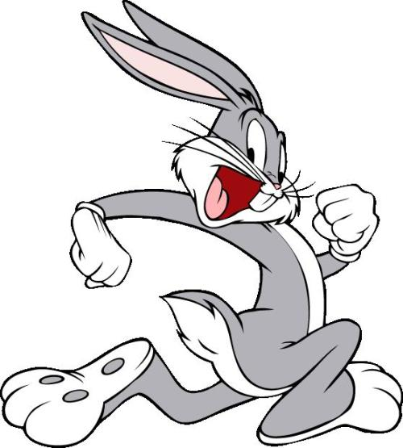

## 图片亮度变化动效

### 效果图


### 思路
- CSS 动画效果依赖于以下知识点的掌握：
	- animation 属性
	- @keyframes 自定义动画规则
- 图片亮度变化需要用到 filter 属性的 brightness 方法。brightness 会给元素应用亮度的线性变化效果
	- 其值为百分数时，如果值是 0%，图像会全黑；值是 100%，则图像无变化；超过100%，元素亮度线性增加
	- 其值为整数时，对应于百分数的效果。0 对应于 0%，1 对应于 100%，3 对应于 300%，以此类推
	- IE 不支持 filter 属性

### HTML
``` html
<div id="container">
	
</div>
```
**解析**    
- html 中添加图片容器元素，容器中添加图片元素

### CSS
``` css
.brighter-img {
	width: 300px;
	height: 300px;
	animation: brighter 3s;
}

@keyframes brighter {
	from {
		filter: brightness(300%);
		/* filter: brightness(3); */
	}
	to {
		filter: brightness(100%);
		/* filter: brightness(1); */
	}
}
```
**解析**   
- @keyframes 添加自定义动画 brighter，开始阶段设置图片亮度为原始的 3 倍，结束阶段设置亮度为正常值
- 添加图片的动画属性 animation，动画效果为 brighter。根据实际效果设置适合的动画时长

### Gitbub 源码
https://github.com/nanzhangren/CSS_skills/blob/master/animation/brighter_image/brighter_image.html